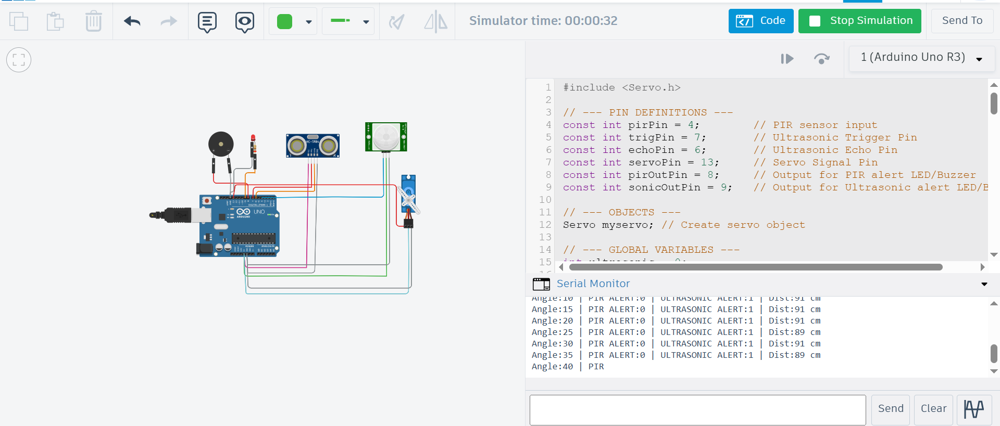

# Arduino-Based Air Intrusion Detection System

## 🏆 Achievement
**Winner – Applied Physics Project Competition**

An Arduino Uno–based air intrusion detection system controlled via a **Bluetooth Terminal application**, featuring a **menu-driven command interface** for real-time monitoring and control.


---

## 📌 Description
This project implements an air intrusion detection mechanism using **Ultrasonic and PIR sensors** mounted on a **servo-based sweeping system**. The system is fully controlled through a **Bluetooth Terminal app**, allowing the user to interact with the device using command-based options instead of physical displays or indicators.

The project demonstrates practical integration of **embedded systems, applied physics, and wireless control**.

---

## ⚙️ Hardware Components
- Arduino Uno  
- Ultrasonic Sensor (distance measurement)  
- PIR Sensor (motion detection)  
- Servo Motor (sweeping mechanism)  
- Bluetooth Module (HC-05 / HC-06)  
- Breadboard  
- Jumper Wires  

---

## 📱 Control Interface (Bluetooth Terminal)
The system is operated using a **Bluetooth Terminal mobile application** with the following command options:

- Start Detection  
- Stop Detection  
- Sweep Enable / Disable  
- Check Current Angle  
- Change Sweep Angle  
- Alert Enable / Disable  
- PIR Sensor Enable / Disable  

All system feedback and status messages are transmitted via Bluetooth serial communication.

---

## 🧠 Working Principle
1. The servo motor sweeps the ultrasonic sensor across a defined angle range.
2. Distance readings are continuously monitored during the sweep.
3. The PIR sensor detects motion to confirm intrusion.
4. When intrusion conditions are met:
   - The system sends alerts via Bluetooth Terminal
5. All operations can be controlled dynamically using Bluetooth commands.




---

## 🔬 Applied Physics Concepts
- Ultrasonic wave propagation and reflection  
- Time-of-flight distance calculation  
- Motion detection principles (PIR sensor)  
- Electrical to mechanical energy conversion  

---

## 🛠 Software Used
- Arduino IDE  
- Embedded C (Arduino Language)  
- Bluetooth Terminal Mobile Application  

---

## 📂 Project Structure :
```bash
arduino-air-intrusion-detection/
│
├── code/
│   └── air_intrusion_detection.ino     # Arduino source code
│
├── docs/
│   ├── project_images.jpg              # Project setup and demo images
│   └── circuit_diagram.png             # Circuit wiring diagram
│
├── README.md                           # Project documentation
└── LICENSE                             # License file
```
